# SE-AI Mind (Darwin 0.1)

<p align="center">
  <picture>
    <source media="(prefers-reduced-motion: reduce)" srcset="assets/hero/hero-reduced.svg">
    <source media="(prefers-color-scheme: light)" srcset="assets/hero/hero-light.svg">
    
  </picture>
</p>

<p align="center">
  <picture>
    <source media="(prefers-reduced-motion: reduce)" srcset="assets/hero/computational-dark.svg">
    <source media="(prefers-color-scheme: light)" srcset="assets/hero/computational-light.svg">
    
  </picture>
</p>

Open-source self-evolving AI kernel. Small kernel, growing intelligence:
Minds + Models + Memory + Skills + Tools + Evolution + Evaluation.

## Quickstart

```bash
pnpm install
pnpm build
pnpm test

node packages/cli/dist/cli.js doctor
node packages/cli/dist/cli.js init --name DarwinTest
node packages/cli/dist/cli.js run "What is 2 + 2?"
```

With a local Ollama server running, model tasks execute for real; without
one, the system fails honestly instead of faking inference.

## First evolution loop (deterministic, no model needed)

```bash
node packages/cli/dist/cli.js evolve propose --mind default
node packages/cli/dist/cli.js evolve history --mind default
node packages/cli/dist/cli.js evolve promote <experimentId> --mind default
node packages/cli/dist/cli.js run "What is 3 + 3? Answer in JSON." --mind default
node packages/cli/dist/cli.js evolve rollback --mind default
```

## Model-backed evolution (needs a local runtime, e.g. Ollama)

```bash
node packages/cli/dist/cli.js evolve propose --mind default --suite extraction-json-v1 --models --candidates json-only-prompt,polite-json-prompt
node packages/cli/dist/cli.js evolve compare <experimentId> --mind default
```

`compare` shows per-arm measurements and deltas. Promotion stays explicit;
`--models` is required — without a reachable runtime the suite holds honestly.

## Architecture (7 build units)

`core` ← `runtime`, `state` ← `mind` ← `sdk` ← `cli`; `web/` standalone.
See `docs/architecture/` (MINIMAL_KERNEL, MIND_MODEL, MEMORY_MODEL,
RUNTIME_BOUNDARY, EXECUTION_MODEL, EVOLUTION_MODEL, EVOLUTION_EXPERIMENTS,
EVOLUTION_GATES, INTELLIGENCE_GENOME, GENOME_MODEL, COGNITIVE_COMPILER)
and `docs/audit/` (ground truth, compression results, GitHub/Vercel status).

## Honest status

- REAL: Mind lifecycle, Mind-isolated memory, deterministic + Ollama model
  execution, routing over healthy runtimes, real evolution experiments with
  measured gates, explicit promotion, real rollback, durable history.
- PARTIAL: tools/skills (some executors stubbed), evolution reviews beyond
  the gate checks, compiler optimization.
- STUB (labeled in code/docs): MLX adapter, local test fixture, LLM-judge,
  OS-level sandboxing, weight evolution.

No fake capability is presented as real. See `docs/audit/COMPRESSION_RESULTS.md`.

<!-- TRILLIONX:presentation:begin -->

### Animated surfaces

Generated from this repository's own source tree: every count, route and module below was measured, not written by hand.

#### Identity

<picture>
  <source media="(prefers-reduced-motion: reduce)" srcset="https://raw.githubusercontent.com/M4G3LL4N0/seai-mind/main/.github-art/surfaces/hero-reduced.svg">
  <source media="(prefers-color-scheme: light)" srcset="https://raw.githubusercontent.com/M4G3LL4N0/seai-mind/main/.github-art/surfaces/hero-light.svg">
  
</picture>

#### Entry points

<picture>
  <source media="(prefers-reduced-motion: reduce)" srcset="https://raw.githubusercontent.com/M4G3LL4N0/seai-mind/main/.github-art/surfaces/terminal-reduced.svg">
  <source media="(prefers-color-scheme: light)" srcset="https://raw.githubusercontent.com/M4G3LL4N0/seai-mind/main/.github-art/surfaces/terminal-light.svg">
  
</picture>

#### Modules

<picture>
  <source media="(prefers-reduced-motion: reduce)" srcset="https://raw.githubusercontent.com/M4G3LL4N0/seai-mind/main/.github-art/surfaces/architecture-reduced.svg">
  <source media="(prefers-color-scheme: light)" srcset="https://raw.githubusercontent.com/M4G3LL4N0/seai-mind/main/.github-art/surfaces/architecture-light.svg">
  
</picture>

#### Primitives

<picture>
  <source media="(prefers-reduced-motion: reduce)" srcset="https://raw.githubusercontent.com/M4G3LL4N0/seai-mind/main/.github-art/surfaces/state_machine-reduced.svg">
  <source media="(prefers-color-scheme: light)" srcset="https://raw.githubusercontent.com/M4G3LL4N0/seai-mind/main/.github-art/surfaces/state_machine-light.svg">
  
</picture>

#### Composition

<picture>
  <source media="(prefers-reduced-motion: reduce)" srcset="https://raw.githubusercontent.com/M4G3LL4N0/seai-mind/main/.github-art/surfaces/component_map-reduced.svg">
  <source media="(prefers-color-scheme: light)" srcset="https://raw.githubusercontent.com/M4G3LL4N0/seai-mind/main/.github-art/surfaces/component_map-light.svg">
  
</picture>

#### Build and tests

<picture>
  <source media="(prefers-reduced-motion: reduce)" srcset="https://raw.githubusercontent.com/M4G3LL4N0/seai-mind/main/.github-art/surfaces/build-reduced.svg">
  <source media="(prefers-color-scheme: light)" srcset="https://raw.githubusercontent.com/M4G3LL4N0/seai-mind/main/.github-art/surfaces/build-light.svg">
  
</picture>

#### Workflow

<picture>
  <source media="(prefers-reduced-motion: reduce)" srcset="https://raw.githubusercontent.com/M4G3LL4N0/seai-mind/main/.github-art/surfaces/workflow-reduced.svg">
  <source media="(prefers-color-scheme: light)" srcset="https://raw.githubusercontent.com/M4G3LL4N0/seai-mind/main/.github-art/surfaces/workflow-light.svg">
  
</picture>

#### Domain

<picture>
  <source media="(prefers-reduced-motion: reduce)" srcset="https://raw.githubusercontent.com/M4G3LL4N0/seai-mind/main/.github-art/surfaces/domain-reduced.svg">
  <source media="(prefers-color-scheme: light)" srcset="https://raw.githubusercontent.com/M4G3LL4N0/seai-mind/main/.github-art/surfaces/domain-light.svg">
  
</picture>

#### Identity object

<picture>
  <source media="(prefers-reduced-motion: reduce)" srcset="https://raw.githubusercontent.com/M4G3LL4N0/seai-mind/main/.github-art/surfaces/footer-reduced.svg">
  <source media="(prefers-color-scheme: light)" srcset="https://raw.githubusercontent.com/M4G3LL4N0/seai-mind/main/.github-art/surfaces/footer-light.svg">
  
</picture>

<!-- TRILLIONX:presentation:end -->

<!-- TRILLIONX:evidence:begin -->

## What is measurable here

Generated by `.github-art` from the source tree at publish time.

| Signal | Value |
| --- | --- |
| HTTP routes | 0 |
| Entry points | 7 |
| Module roots | 8 |
| Test files | 12 |
| CI workflows | 1 |
| Distinctive stack | Zod |
| Status | LIVE |
| Evidence confidence | E3 |
| Animated surfaces | 9 |

<!-- TRILLIONX:evidence:end -->
